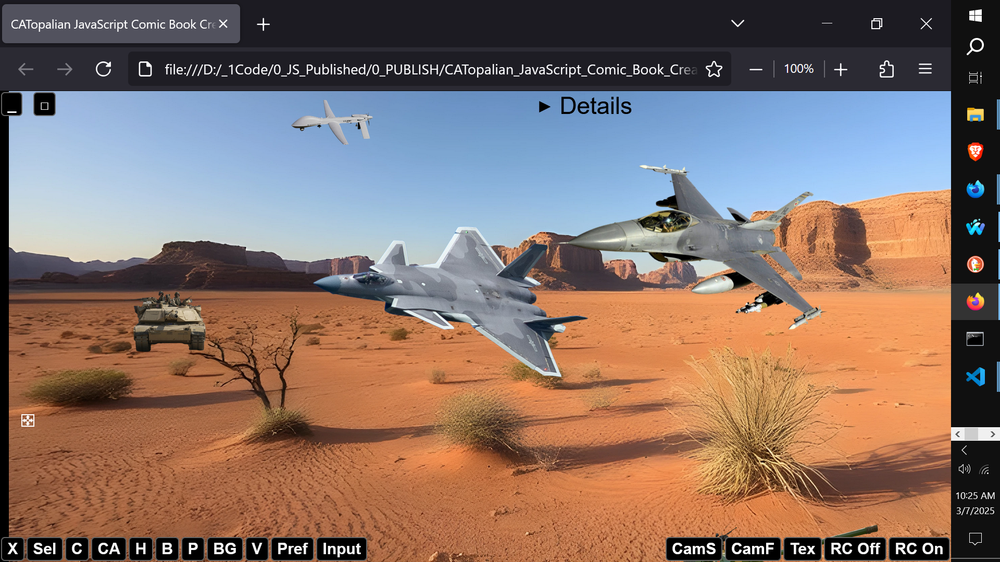
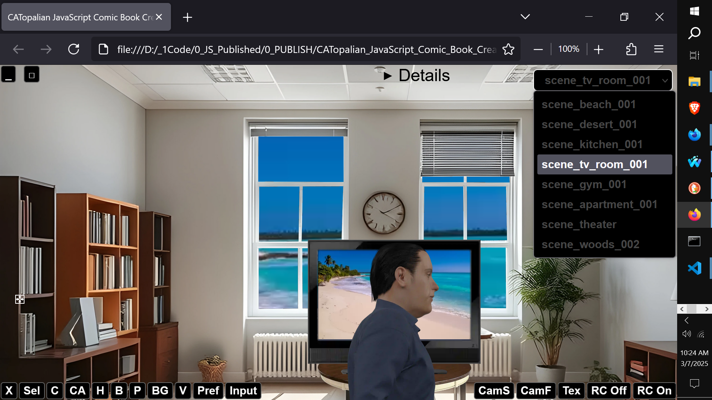
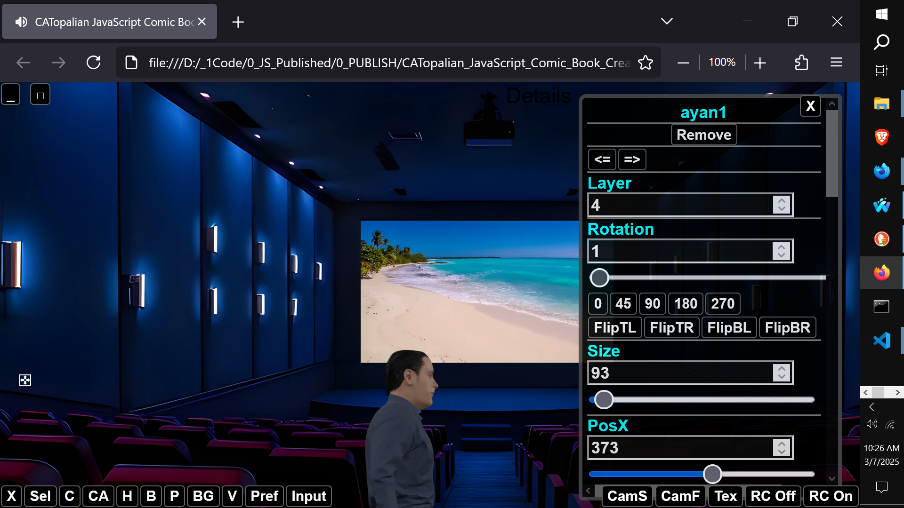

# CATopalian JavaScript Comic Book Creator
A JavaScript creation application that enables the person to create comic book scenes with a game engine built in to move any character. It can also be used as a deep fake studio, by utilizing the many filters.

USE APP: https://christopherandrewtopalian.github.io/CATopalian_JavaScript_Comic_Book_Creator/CATopalian_JavaScript_Comic_Book_Creator.html

VIDEOS:  
https://www.youtube.com/watch?v=aswd3T2nVdU

https://www.youtube.com/watch?v=reVhfmYnG1c

https://www.youtube.com/watch?v=mUsod_uU5tU

https://www.youtube.com/watch?v=-7jjU9yr1ho

https://www.youtube.com/watch?v=H0jGeRb6q8A

---

### How to Download this App
1. Click the green Code Button on this github page
2. Choose Download ZIP
3. Save the Zip File
4. Extract All
5. Double click the HTML file to start the App

---

Happy Scripting :-)